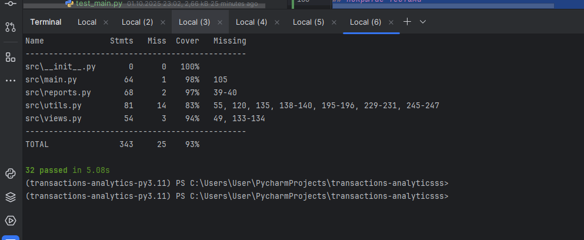

 # Аналитика транзакций

Приложение предназначено для анализа транзакций. Оно позволяет формировать отчёты, генерировать JSON-данные для веб-страниц и предоставлять дополнительные сервисы.

## Функционал

**Веб-страницы**
- Главная: отображает приветствие и данные по дате/времени
- События: список транзакций в заданный период

**Сервисы**
- Инвесткопилка (округление трат до лимита и накопления)
- Простой поиск (поиск транзакций по ключевым словам)
- Поиск по телефонным номерам
- Поиск переводов физическим лицам (p2p)
- Выгодные категории повышенного кешбэка

**Отчёты**
- Траты по категории
- Траты по дням недели
- Траты по рабочим/выходным дням

## Структура проекта

```
.
├── src
│   ├── __init__.py
│   ├── utils.py
│   ├── main.py
│   ├── views.py
│   ├── reports.py
│   └── services.py
├── tests
│   ├── __init__.py
│   ├── test_utils.py
│   ├── test_views.py
│   ├── test_reports.py
│   └── test_services.py
├── user_settings.json
├── .env
├── .env_template
├── .gitignore
├── .flake8
├── pyproject.toml
├── poetry.lock
└── README.md
```

## Установка и запуск

1. Установите зависимости:
   ```bash
   poetry install
   ```

2. Проверьте код линтерами:
   ```bash
   poetry run flake8
   poetry run isort --check-only .
   poetry run black --check .
   poetry run mypy src
   ```

3. Запустите тесты:
   ```bash
   poetry run pytest --cov=src --cov-report=term-missing
   ```

4. Запуск приложения:
   ```bash
   poetry run python -m src.main <команда> [аргументы]
   ```

## Тестирование

- Покрытие кода тестами — более **90%**
- Используются:
  - `mock` и `patch` для подмены зависимостей
  - фикстуры для генерации тестовых данных
  - параметризация для сокращения кода тестов
- Проверка покрытия:
  ```bash
  poetry run pytest --cov=src --cov-report=html
  ```
  Отчёт будет в папке `htmlcov/`.

## Качество кода

- Соблюдены правила PEP8
- Настроены `flake8`, `black`, `isort`, `mypy`
- В коммиты не добавляются лишние файлы
- Все функции содержат docstring (PEP 257)

## Итог

Проект соответствует критериям:
- Проект структурирован по ТЗ
- Есть README с описанием
- Поддержка `.env` и шаблона `.env_template`
- Все сервисы и страницы работают
- Код протестирован и покрыт на 90%+
- Используются фикстуры, mock, patch, параметризация


## Покрытие тестами

Результат выполнения тестов с измерением покрытия:



